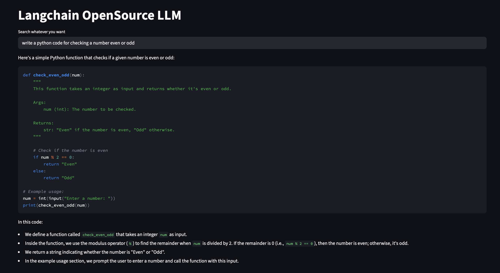

# Conversify

Conversify is a AI chatbot built using LangGraph and Groq LLM, providing a powerful, interactive interface with tool integration for web search, calculations, and stock prices.
- LangGraph – manages chat state, graph-based workflow, and conversation threads
- Groq LLM – runs the deepseek-r1-distill-llama-70b model 
- Streamlit – interactive web interface
- Tools – DuckDuckGo search, calculator, stock price fetch

---

## **Features**

- Multi-threaded chat with conversation history
- AI can call external tools (calculator, DuckDuckGo, stock price API)
- Streamed responses for real-time chatting
- Fully local LLM inference with Groq backend
- SQLite-based persistent storage for chat history

---

## Setup Instructions

### 1. Clone the repository

```bash
git clone https://github.com/prashantpq/Langchain-OpenSource-LLM.git
cd Langchain-OpenSource-LLM
```

### 2. Create a virtual environment
```bash
python -m venv myenv
source myenv/bin/activate  # Mac/Linux
# OR
myenv\Scripts\activate  # Windows
```

### 3. Install dependencies
```bash
pip install -r requirements.txt
```

### 4. Configure environment
```bash
Create a .env file and add your API keys (Groq API key, Alpha Vantage key)
Ensure .env is added to .gitignore to prevent committing secrets
touch .env

```

### 5. Run the Streamlit app
```bash
streamlit run frontend.py
```

---
## Architecture diagram
```mermaid
flowchart TD
    subgraph UI
        A[Streamlit Chat Interface] --> B[User Input]
        B --> C[Chat Thread Manager]
        C --> D[Message History (Session State)]
    end

    subgraph Backend
        D --> E[LangGraph StateGraph]
        E --> F[Chat Node (Groq LLM)]
        F --> G[Tool Node]
        G --> F
        F --> D
    end

    subgraph Tools
        H[Calculator] 
        I[DuckDuckGo Search]
        J[Stock Price API]
        G --> H
        G --> I
        G --> J
    end

    subgraph Persistence
        K[SQLite Database (.db)]
        D --> K
        K --> D
    end

    style UI fill:#f9f,stroke:#333,stroke-width:2px
    style Backend fill:#bbf,stroke:#333,stroke-width:2px
    style Tools fill:#bfb,stroke:#333,stroke-width:2px
    style Persistence fill:#ffb,stroke:#333,stroke-width:2px


---

## Output Screenshot

Here is a sample output of the chatbot running:



---


