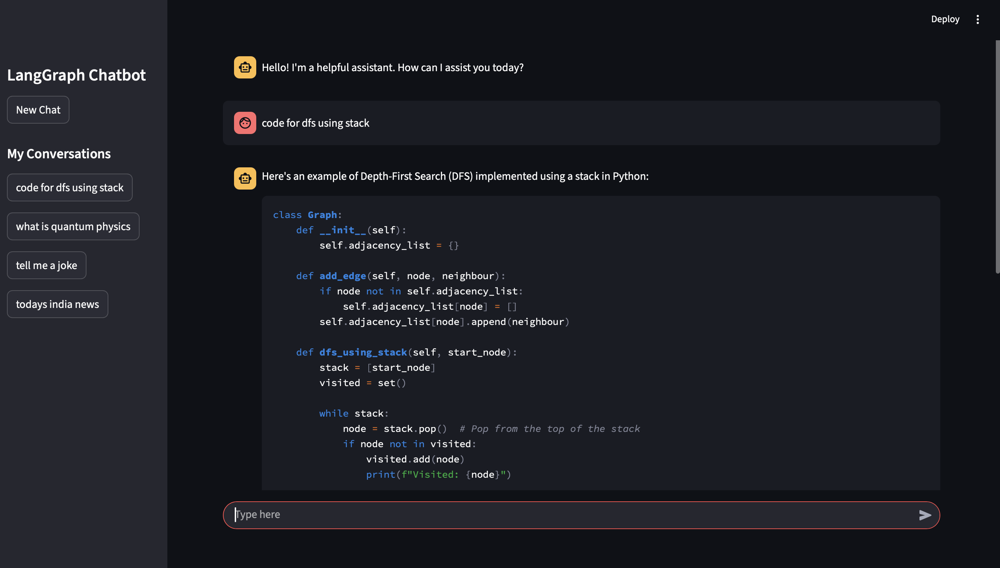

# Conversify

Conversify is a AI chatbot built using LangGraph and Groq LLM, providing a powerful, interactive interface with tool integration for web search, calculations, and stock prices.
- LangGraph – manages chat state, graph-based workflow, and conversation threads
- Groq LLM – runs the deepseek-r1-distill-llama-70b model 
- Streamlit – interactive web interface
- Tools – DuckDuckGo search, calculator, stock price fetch

---

## **Features**

- Multi-threaded chat with conversation history
- AI can call external tools (calculator, DuckDuckGo, stock price API)
- Streamed responses for real-time chatting
- Fully local LLM inference with Groq backend
- SQLite-based persistent storage for chat history

---

## Setup Instructions

### 1. Clone the repository

```bash
git clone https://github.com/prashantpq/Langchain-OpenSource-LLM.git
cd Langchain-OpenSource-LLM
```

### 2. Create a virtual environment
```bash
python -m venv myenv
source myenv/bin/activate  # Mac/Linux
# OR
myenv\Scripts\activate  # Windows
```

### 3. Install dependencies
```bash
pip install -r requirements.txt
```

### 4. Configure environment
```bash
Create a .env file and add your API keys (Groq API key, Alpha Vantage key)
Ensure .env is added to .gitignore to prevent committing secrets
touch .env

```

### 5. Run the Streamlit app
```bash
streamlit run frontend.py
```
---

## Output Screenshot

Here is a sample output of the chatbot running:



---
## Architecture diagram
```mermaid
flowchart TD
    User["User"] --> Streamlit["Streamlit Chat Interface"]
    Streamlit --> ThreadMgr["Chat Thread Manager"]
    ThreadMgr --> MsgHistory["Message History (Session State)"]
    
    MsgHistory --> LangGraph["LangGraph StateGraph"]
    LangGraph --> ChatNode["Chat Node (Groq LLM)"]
    
    ChatNode --> ToolCheck{Does AI need a Tool?}
    
    ToolCheck -->|Yes| ToolNode["Tool Node"]
    ToolCheck -->|No| AIResponse["Use AI Response Directly"]
    
    ToolNode --> Calculator["Calculator Tool"]
    ToolNode --> DuckDuckGo["DuckDuckGo Search Tool"]
    ToolNode --> StockPrice["Stock Price Tool"]
    ToolNode --> Merge["Merge Tool Output with AI Response"]
    
    AIResponse --> Merge
    Merge --> MsgHistory
    MsgHistory --> SQLiteDB["SQLite Database (.db) - Persistent Storage"]
    
    SQLiteDB --> MsgHistory
    MsgHistory --> Streamlit
    Streamlit --> User


